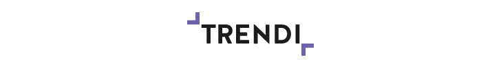

Agora você vai poder mostrar um pouco do que sabe! :D

### Instalação

* Faça um fork desse projeto
````git clone https://github.com/<your-user>/trendi-front-end-jr````
* O PSD está dentro da pasta `/psd`

### Desenvolvimento

O teste consiste em codificar um exemplo de projeto responsivo. Em telas menores do que 768px o `<header>` estar fechado e abrir após ativar o botão de menu. Em telas maiores do que 768px ele já deve estar aberto.

* Desenvolva no arquivo `index.html` dentro da pasta `/public`
* O CSS está dentro da pasta `/public/assets/css` e já contém um `reset`
* Para fazer a ação do menu em JavaScript use o `/public/assets/js/main.js` (pode usar jQuery)
* Mas não necessariamente essa ação precisa ser feita em JavaScript, pode usar outras soluções :)
* As imagens estão dentro da pasta `/public/assets/img`
* Coloque o texto em lorem ipsum
* O resultado final não precisa estar exatamente igual ao PSD, faça o mais próximo possível

### Entrega

* Faça um **Pull Request** até o prazo limite

Boa sorte \o/

### Licença

MIT License © [Trendi](http://www.trendi.com.br/)
